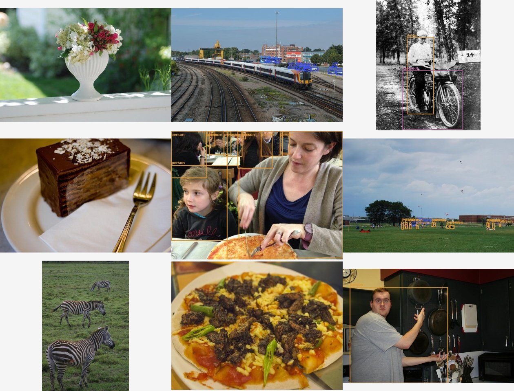
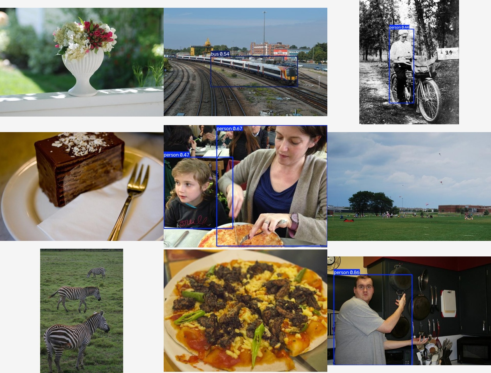
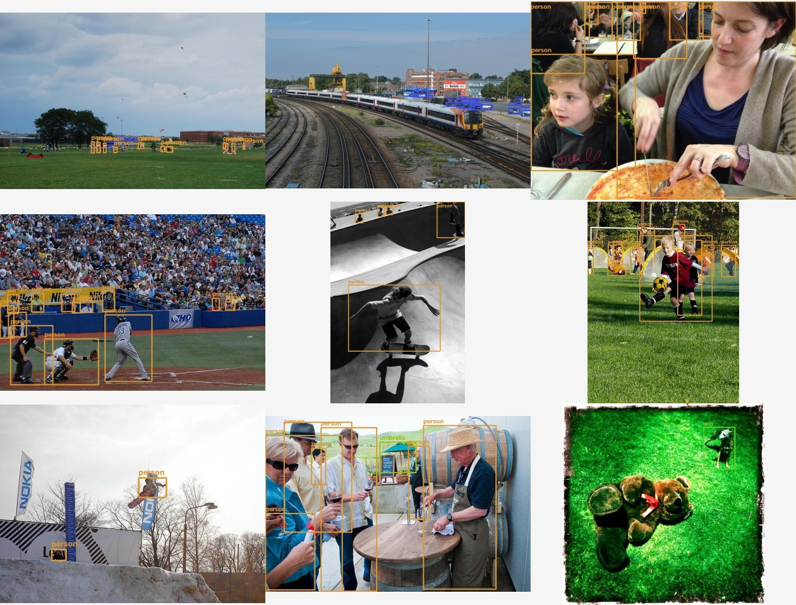
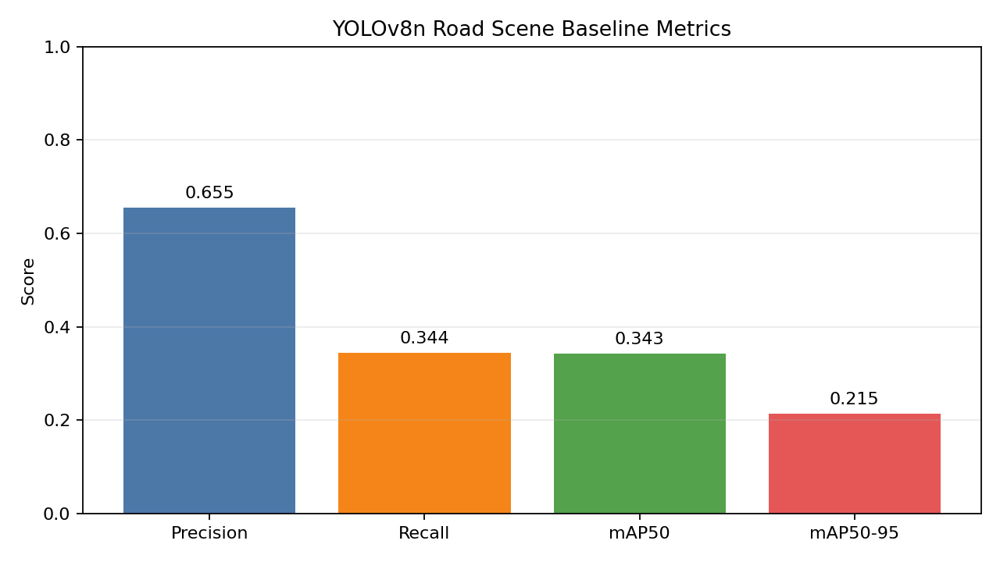
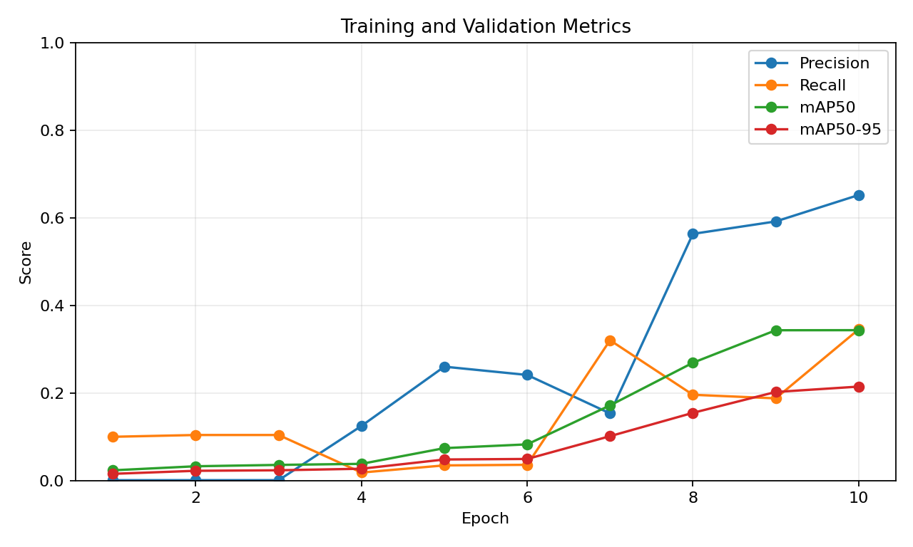
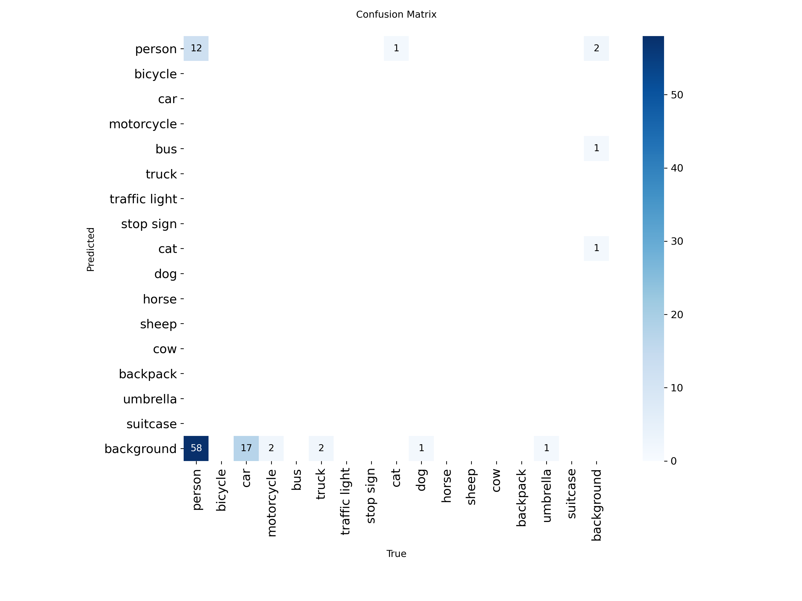
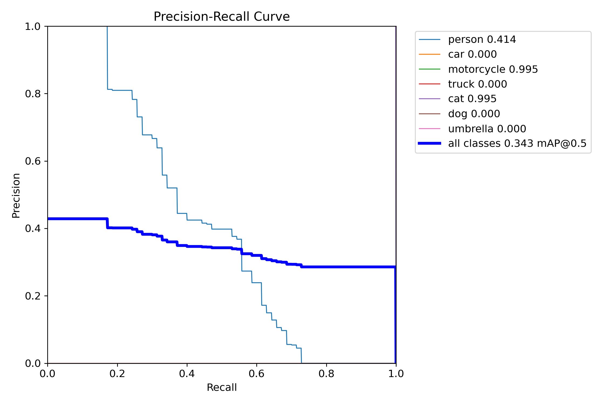

# Road Scene Object Detection

[](https://github.com/Ylt00/road-scene-object-detection/actions/workflows/ci.yml)


Multi-class road scene object detection for intelligent driving and automotive vision. The project covers data preparation, YOLOv8n training, evaluation, prediction, visual reporting, model comparison, and automated testing.

## Project Highlights

- Curates 16 road-related classes from COCO128
- Trains and evaluates a YOLOv8n baseline
- Generates detection grids, metric charts, confusion matrices, and PR curves
- Compares YOLOv8n with a P2 high-resolution detection-head experiment
- Documents a negative P2 result instead of selecting only favorable metrics
- Provides an installable CLI and GitHub Actions CI

## Detection Results







## Evaluation Analysis









## Model Results

| Model | Precision | Recall | mAP50 | mAP50-95 | Params | GFLOPs |
|---|---:|---:|---:|---:|---:|---:|
| YOLOv8n pretrained | 0.655 | 0.344 | 0.343 | 0.215 | 3,008,768 | 8.1 |
| YOLOv8n-P2 | 0.746 | 0.010 | 0.010 | 0.003 | 2,923,152 | 12.2 |

The P2 experiment underperformed in the current small-data, short CPU-training setting. The controlled setup, reasons, and limitations are documented in `docs/experiments/model-comparison.md`.

## Quick Start

Install the package:

```powershell
python -m pip install -e ".[train]"
```

Prepare the road-scene dataset:

```powershell
python -m road_scene.cli prepare-data --archive data/downloads/coco128.zip --raw data/raw --output data/processed/road-scene --report reports/road-dataset-stats.json --force
python -m road_scene.cli validate --data data/processed/road-scene/data.yaml
```

Train the baseline:

```powershell
python -m road_scene.cli train --config configs/road-scene-cpu.yaml
```

Evaluate:

```powershell
python -m road_scene.cli evaluate --weights runs/train/road-yolov8n-baseline/weights/best.pt --data data/processed/road-scene/data.yaml --imgsz 320 --device cpu
```

Predict:

```powershell
python -m road_scene.cli predict --weights runs/train/road-yolov8n-baseline/weights/best.pt --source data/processed/road-scene/images/val --imgsz 320 --device cpu
```

Generate the visual report:

```powershell
python -m road_scene.cli report --images data/processed/road-scene/images/val --labels data/processed/road-scene/labels/val --predictions runs/predict/road-yolov8n-baseline --metrics runs/val/road-yolov8n-baseline/metrics.json --results runs/train/road-yolov8n-baseline/results.csv --plots runs/val/road-yolov8n-baseline
```

## Dataset

| Item | Value |
|---|---:|
| Source | COCO128 |
| Total images | 128 |
| Training images | 102 |
| Validation images | 26 |
| Retained objects | 389 |
| Filtered objects | 540 |
| Classes | 16 |
| Validation errors | 0 |

Selected classes include vehicles, pedestrians, traffic facilities, animals, and carried objects. See `docs/dataset.md` for the complete mapping.

## Repository Structure

```text
road-scene-object-detection/
├─ configs/                  # YOLOv8n and P2 experiment configs
├─ docs/
│  ├─ analysis/              # Metric charts and comparison plots
│  ├─ assets/                # Detection result grids
│  ├─ experiments/           # Experiment records
│  ├─ dataset.md
│  └─ training.md
├─ reports/                  # JSON metrics and dataset statistics
├─ src/road_scene/           # Python package and CLI
├─ tests/                    # Unit tests
└─ .github/workflows/ci.yml  # Python 3.10 and 3.12 CI
```

## Resume Highlights

- Built a road-scene object detection pipeline covering data filtering, class remapping, validation, YOLOv8n training, mAP evaluation, prediction, and report generation.
- Added a P2 high-resolution detection-head experiment and documented its negative result with controlled variables and failure analysis.
- Developed a CLI and image-report toolkit using PyTorch, Ultralytics, OpenCV, NumPy, and Matplotlib.
- Added unit tests and GitHub Actions CI across Python 3.10 and 3.12.

## Limitations

- COCO128 is a small demonstration subset, not a production autonomous-driving dataset.
- Several classes contain very few examples, so per-class metrics are unstable.
- CPU training is limited to 10 epochs.
- The P2 model requires more data and longer training before its small-object behavior can be evaluated fairly.
- The project is for engineering and research learning, not real-world driving deployment.

## License

MIT